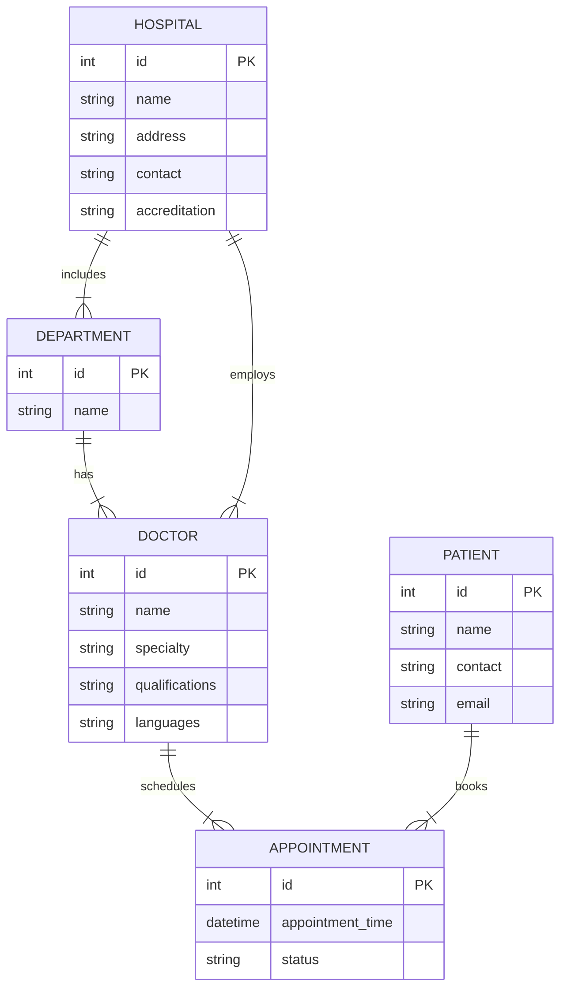
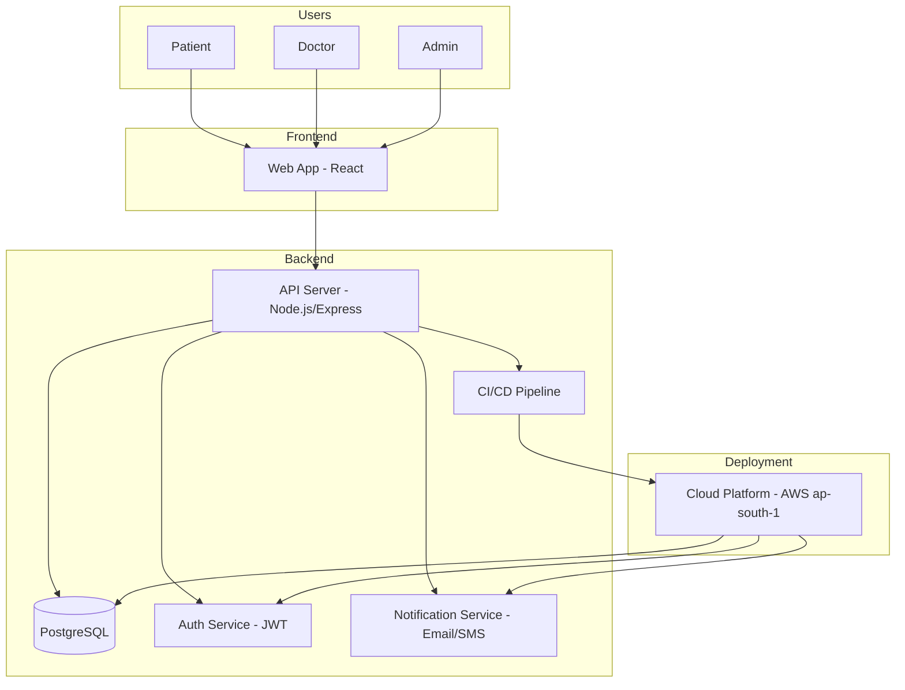

# MASTER PROMPT — Bangalore Multi-Hospital Doctor Appointment App

> Paste everything below this line into a capable coding agent (Claude Code, Cursor, etc.). It is self-contained: it includes the hospital details, the full seed dataset, the data model, API surface, compliance rules, DevOps plan and output format.

---

## 0. ROLE AND GOAL

You are a senior full-stack engineer and architect. Build a **complete, production-grade doctor-appointment web application for a multi-hospital network in Bangalore, India**. Patients browse hospitals and doctors, see real-time availability and book appointments. Doctors manage their schedules and bookings. Admins manage hospitals, departments, doctors, users and reports.

Deliver: frontend, backend, database schema and migrations, REST API with OpenAPI spec, authentication and RBAC, notifications, seed data, tests, Docker, CI/CD, infrastructure-as-code and documentation. Everything must run locally with a single `docker compose up`.

### Working mode (important)
The full app is larger than a single response. Work in **phases** (see Section 14). Finish each phase completely, one file at a time, with full file contents (no "...rest of code" placeholders). If you hit an output limit, stop at a clean file boundary and end with `CONTINUE FROM: <next file path>`. Do not skip phases. Do not invent data that is not in Section 3 (see the data rules there).

---

## 1. FIXED TECH STACK (do not substitute)

| Layer | Choice |
|---|---|
| Frontend | React 18 + TypeScript + Vite, React Router, TanStack Query, React Hook Form + Zod, Material-UI (MUI), date handling with date-fns / date-fns-tz |
| Backend | Node.js 20 + Express + TypeScript, Zod validation, Pino logging, Helmet, CORS allow-list, express-rate-limit |
| ORM / DB | PostgreSQL 16 + Prisma (migrations + seed script) |
| Auth | JWT access tokens (15 min) + rotating refresh tokens in httpOnly, Secure, SameSite cookies; password hashing with argon2id; RBAC roles `PATIENT`, `DOCTOR`, `ADMIN` |
| Notifications | Provider-agnostic `NotificationService` with adapters: SendGrid (email), Twilio (SMS), and a console adapter for dev/test. Queue with BullMQ + Redis for confirmations and reminders |
| API docs | OpenAPI 3.0 served with Swagger UI at `/api/docs` |
| Testing | Vitest/Jest + Supertest (backend), Vitest + React Testing Library (frontend), Playwright (2–3 end-to-end flows) |
| DevOps | Docker (multi-stage), docker-compose, GitHub Actions, Terraform for AWS `ap-south-1` (Mumbai), optional Helm chart |

Time zone: **Asia/Kolkata (IST)** for all display and slot generation; store timestamps in UTC.

---

## 2. PRODUCT SCOPE AND USER FLOWS

### 2.1 Patient booking flow
1. Patient registers or logs in. At registration they must accept purpose-specific consent (Section 8).
2. Patient browses/searches doctors by **specialty, hospital, department, language, name**. Hospital pages show address, map (lat/lon), departments, contact, website, accreditation badges and emergency availability.
3. Doctor profile shows photo (with placeholder fallback), qualifications, specialty, languages, affiliated hospitals, weekly consultation hours and **real-time availability** (bookable slots for the next 30 days).
4. Patient selects a slot and confirms. The system prevents double booking atomically. (Payment is a stubbed, optional step behind a feature flag; no real payment integration.)
5. Confirmation shown on screen; email + SMS confirmation queued; reminders queued (24 h and 2 h before).
6. "My Bookings" lets the patient view, reschedule and cancel (cancellation allowed up to a configurable cut-off, default 2 hours before).

### 2.2 Doctor portal
- Set weekly availability per hospital affiliation (day, start, end, slot length), block holidays/time-off, and view appointments in a day/week calendar.
- Confirm, reschedule, mark **completed** or **no-show**. Patients are notified of every change.
- A doctor can never be booked at two hospitals at overlapping times (enforced server-side).

### 2.3 Admin panel
- CRUD for hospitals, departments, doctors (and doctor–hospital affiliations), and user role management.
- View all appointments across hospitals with filters; reports: daily bookings, cancellations, no-shows, per-hospital and per-specialty counts (chart + CSV export).
- View audit logs and basic system health.

---

## 3. REFERENCE DATA (SEED DATA — USE EXACTLY AS GIVEN)

### 3.1 Hospital comparison table (all 10 hospitals)

| Hospital | Type | Key Specialties | Emergency | Beds | Accreditation |
|---|---|---|:---:|:---:|---|
| Apollo Hospitals (Bannerghatta Road) | Private | Cardiology, Oncology, Neurology, Orthopedics | Yes | 270 | NABH, JCI |
| Fortis Hospital (Cunningham Rd) | Private | Multispecialty (Cardio, Neuro, Ortho) | Yes | 180 | NABH |
| Fortis Hospital (Bannerghatta) | Private | Multispecialty (ICU, Trauma) | Yes | 300 | NABH |
| Aster RV Hospital | Private | Cardiology, Neurology, Critical Care | Yes | 250 | NABH |
| HCG Cancer Centre | Private | Oncology (cancer), Hematology | No (oncology focus) | 700 | NABH |
| BGS Gleneagles Global | Private | Cardiology, Transplants, Radiology | Yes | 490 | NABH |
| Rainbow Children's Hospital | Private | Pediatrics, Neonatology | Yes | 300 | NABH |
| Hosmat Hospital | Private | Orthopedics, Spine, Joint Replacement | Yes | 650 | NABH |
| Narayana Hrudayalaya (JnanaBhumi) | Private | Cardiology, Heart Surgery | Yes | 710 total Bangalore (see note) | NABH, JCI |
| NIMHANS | Government | Psychiatry, Neurosciences | Yes | ~420 | NABL (Labs) |

Notes from the source report:
- Narayana Health (various campuses) has ~1500 beds in Bangalore overall; the 710 figure is inconsistent with that. Store `beds = null` and put the text in `bedsNote`.
- Other Bangalore hospitals mentioned in the report as part of the wider network (add later via admin panel, do not seed): Manipal Hospital (Whitefield), St. John's, and other Narayana campuses.
- Many of these facilities are NABH-accredited and offer 24×7 emergency services. Hospital sizes: Apollo Bannerghatta is a 270-bed multispecialty center; Hosmat is a 650-bed ortho-trauma center.
- Source attribution: Medsurge India hospital listings; NABH directory.

### 3.2 Detailed dataset (JSON — canonical records with address, geolocation, contact, website)

```json
{
  "hospitals": [
    {
      "name": "Apollo Hospital, Bannerghatta Road",
      "address": "154/11 Bannerghatta Main Road, Bangalore, Karnataka 560076, India",
      "geolocation": { "lat": 12.915, "lon": 77.599 },
      "departments": ["Cardiology", "Oncology", "Neurology", "Orthopedics", "Emergency"],
      "contact": "+91-80-68250000",
      "website": "https://www.apollohospitals.com/hospitals/apollo-hospitals-bannerghatta-road",
      "accreditation": ["NABH", "JCI"]
    },
    {
      "name": "Fortis Hospital, Cunningham Road",
      "address": "14 Cunningham Road, Vasant Nagar, Bangalore 560052, India",
      "geolocation": { "lat": 12.960, "lon": 77.595 },
      "departments": ["Cardiology", "Nephrology", "Neurology", "Orthopedics", "Emergency"],
      "contact": "+91-80-66126868",
      "website": "https://www.fortishealthcare.com/india/hospitals/fortis-hospital-bangalore",
      "accreditation": ["NABH"]
    },
    {
      "name": "HCG Cancer Center, Bangalore",
      "address": "No 8, HCG Towers, P. Kalinga Rao Road, Sampangi Ram Nagar, Bangalore 560020, India",
      "geolocation": { "lat": 12.987, "lon": 77.578 },
      "departments": ["Medical Oncology", "Radiation Oncology", "Surgical Oncology"],
      "contact": "+91-80-41433000",
      "website": "https://www.hcgoncology.com/oncology-hospitals/bangalore",
      "accreditation": ["NABH"]
    }
  ],
  "doctors": [
    {
      "name": "Dr. Priya Kapoor",
      "specialty": "Cardiology",
      "qualifications": "MD, DM (Cardiology)",
      "affiliations": ["Apollo Hospital, Bannerghatta Road"],
      "department": "Cardiology",
      "hours": "Mon–Fri 10:00–16:00",
      "languages": ["English", "Hindi"],
      "contact": "priya.kapoor@apollohospitals.com",
      "photo": "https://www.apollohospitals.com/doctors/priyakapoor.jpg"
    },
    {
      "name": "Dr. Rajesh Malhotra",
      "specialty": "Oncology",
      "qualifications": "MBBS, MD (Oncology)",
      "affiliations": ["Apollo Hospital, Bannerghatta Road", "HCG Cancer Center, Bangalore"],
      "department": "Medical Oncology",
      "hours": "Tue–Sat 11:00–17:00",
      "languages": ["English", "Kannada"],
      "contact": "rajesh.malhotra@hcgoncology.com",
      "photo": "https://www.hcgoncology.com/doctors/rajeshmalhotra.jpg"
    },
    {
      "name": "Dr. Anita Desai",
      "specialty": "Orthopedics",
      "qualifications": "MS, DNB (Ortho)",
      "affiliations": ["Hosmat Hospital, Bangalore"],
      "department": "Orthopedics",
      "hours": "Mon–Fri 09:00–15:00",
      "languages": ["English", "Hindi"],
      "contact": "anita.desai@hosmathospitals.com",
      "photo": "https://www.hosmathospitals.com/doctors/anitadesai.jpg"
    }
  ]
}
```

**Field definitions.** Hospital: name, address, lat/lon geolocation, departments list, contact phone, website, accreditation (NABH/JCI etc.). Doctor: full name, specialty, qualifications, affiliated hospitals and department, weekly consultation hours, languages spoken, contact email, profile photo URL.

### 3.3 Data rules the seed script MUST follow
1. **Merge, don't duplicate.** The 3 JSON hospitals are the canonical records for Apollo Bannerghatta, Fortis Cunningham Road and HCG. Enrich them with `type`, `emergency`, `beds` and key specialties from the Section 3.1 table (e.g. "HCG Cancer Centre" in the table = "HCG Cancer Center, Bangalore" in the JSON).
2. **The other 7 hospitals** (Fortis Bannerghatta, Aster RV, BGS Gleneagles Global, Rainbow Children's, Hosmat, Narayana Hrudayalaya JnanaBhumi, NIMHANS) are seeded from the table only: name, type, emergency, beds, accreditation, and departments derived from "Key Specialties". Their `address`, `latitude`, `longitude`, `contact` and `website` must be **nullable** and left `null` with `dataVerified = false`. **Do not invent addresses, coordinates, phone numbers or URLs.** The admin UI must show a "details pending verification" badge for those rows and allow admins to fill them in.
3. **Dr. Anita Desai is affiliated with "Hosmat Hospital, Bangalore"**, which corresponds to the "Hosmat Hospital" row in the table. Create/link that hospital record accordingly.
4. **Dr. Rajesh Malhotra has two affiliations** (Apollo Bannerghatta Road and HCG). The source lists a single hours string, so seed **Tue–Sat 11:00–17:00 at the first-listed affiliation (Apollo) only**; create the HCG affiliation with no availability rules and a "schedule pending" flag. This also respects the no-overlap rule in Section 2.2.
5. **Convert `hours` strings into structured weekly rules** (`dayOfWeek`, `startTime`, `endTime`, `slotMinutes`, default slot 20 min, configurable) — e.g. "Mon–Fri 10:00–16:00" → five rules Mon..Fri 10:00–16:00.
6. **Doctor entries are illustrative sample data** (the source report describes them as sanitised examples). Photo URLs are unverified and may not resolve: always render with an initials-avatar fallback (`onError`). Seed emails as contact emails only; do **not** create login accounts from them with real addresses. Create demo doctor logins with `@example.test` addresses instead.
7. Show a subtle "Demo data" indicator in the admin panel for seeded doctors until an admin marks them verified.
8. Provide the seed in **both** `prisma/seed.ts` (reads `seed/hospitals.json`, `seed/doctors.json`) and `seed/hospitals.csv` / `seed/doctors.csv`. Seeding must be idempotent (upsert by slug).
9. Also seed: 1 admin (`admin@example.test`), 3 demo doctor users, 3 demo patients, and ~30 sample appointments across past/future dates. Passwords come from environment variables, never hard-coded in committed files other than `.env.example`.

---

## 4. DATA MODEL

Relationships (from the source ER diagram, refined):



Each **Hospital** has many **Departments** and many **Doctors**; a **Doctor** works in one department per hospital but can be affiliated with multiple hospitals. **Patients** book **Appointments** with doctors at specific times.

Implement these Prisma models (add indexes and constraints):

- `User` — id, email (unique), passwordHash, role (`PATIENT|DOCTOR|ADMIN`), isActive, createdAt, lastLoginAt.
- `RefreshToken` — id, userId, tokenHash, expiresAt, revokedAt, replacedById.
- `Hospital` — id, slug (unique), name, type (`PRIVATE|GOVERNMENT`), address?, latitude?, longitude?, contact?, website?, accreditation `String[]`, hasEmergency, beds?, bedsNote?, keySpecialties `String[]`, dataVerified, createdAt, updatedAt.
- `Department` — id, hospitalId, name; unique (hospitalId, name).
- `Doctor` — id, userId? (unique), name, specialty, qualifications, languages `String[]`, contactEmail?, photoUrl?, isDemo, isVerified.
- `DoctorAffiliation` — id, doctorId, hospitalId, departmentId, schedulePending; unique (doctorId, hospitalId).
- `AvailabilityRule` — id, affiliationId, dayOfWeek (0–6), startTime, endTime, slotMinutes.
- `TimeOff` — id, doctorId, startsAt, endsAt, reason?.
- `Patient` — id, userId (unique), name, phone, email, dateOfBirth?, gender?, `medicalNotesEnc` (encrypted).
- `Appointment` — id, patientId, doctorId, affiliationId, startsAt, endsAt, status (`PENDING|CONFIRMED|CANCELLED|COMPLETED|NO_SHOW`), reason?, cancelledBy?, cancelledAt?, createdAt. **Partial unique index** on (doctorId, startsAt) where status in (`PENDING`,`CONFIRMED`) to prevent double booking; also run booking inside a serializable transaction and check cross-hospital overlaps for the same doctor.
- `ConsentRecord` — id, userId, purpose (`MEDICAL_CARE|APPOINTMENT_COMMUNICATIONS|INSURANCE|RESEARCH`), policyVersion, grantedAt, withdrawnAt?.
- `AuditLog` — id, actorUserId, action, entityType, entityId, ip, userAgent, metadata JSON, createdAt (append-only).
- `NotificationLog` — id, appointmentId, channel, type, status, providerMessageId?, createdAt.

---

## 5. REST API (JSON in/out, prefix `/api`)

Auth
- `POST /auth/register` (patients only; requires consents) · `POST /auth/login` · `POST /auth/refresh` · `POST /auth/logout` · `GET /auth/me`

Hospitals & Departments
- `GET /hospitals` (filters: `q`, `accreditation`, `emergency`, `type`, pagination) · `GET /hospitals/:id`
- `POST|PUT|DELETE /hospitals/:id` (ADMIN)
- `GET /departments?hospitalId=` · `POST|PUT|DELETE /departments/:id` (ADMIN)

Doctors
- `GET /doctors?specialty=Cardiology&hospital=Apollo&department=&language=&q=` (example from the source: cardiologists at a given hospital)
- `GET /doctors/:id` · `GET /doctors/:id/availability?hospitalId=&from=&to=` (returns bookable slots)
- `POST|PUT|DELETE /doctors/:id` and affiliation management (ADMIN)
- `GET|PUT /doctors/me/availability` · `POST|DELETE /doctors/me/time-off` (DOCTOR)

Patients
- `GET|PUT /patients/me` · `GET /patients/:id` (ADMIN; audited)

Appointments
- `POST /appointments` · `GET /appointments` (scoped by role) · `GET /appointments/:id`
- `PATCH /appointments/:id/cancel` · `PATCH /appointments/:id/reschedule`
- `PATCH /appointments/:id/status` (DOCTOR/ADMIN: confirm, complete, no-show)

Consent, admin & ops
- `GET|POST /consents` · `DELETE /consents/:purpose` (withdraw)
- `GET /admin/reports/bookings` (+ `?format=csv`) · `GET /admin/users` · `PATCH /admin/users/:id/role` · `GET /admin/audit-logs`
- `GET /health` (liveness/readiness)

Standards: consistent error shape `{ error: { code, message, details? } }`, request validation with Zod on every route, pagination `?page=&pageSize=`, idempotency key support on `POST /appointments`.

### OpenAPI style reference (extend this to cover every endpoint above, with `securitySchemes` for JWT)

```yaml
openapi: 3.0.0
info:
  title: "Bangalore Hospital Appointment API"
  version: 1.0.0

paths:
  /api/hospitals:
    get:
      summary: "Retrieve list of hospitals"
      responses:
        '200':
          description: "A JSON array of hospital objects"
          content:
            application/json:
              schema:
                type: array
                items:
                  $ref: '#/components/schemas/Hospital'

components:
  schemas:
    Hospital:
      type: object
      properties:
        id:
          type: integer
          example: 1
        name:
          type: string
          example: "Apollo Hospital, Bannerghatta Road"
        address:
          type: string
          example: "154/11 Bannerghatta Main Road, Bangalore, Karnataka 560076, India"
        contact:
          type: string
          example: "+91-80-68250000"
        accreditation:
          type: array
          items: { type: string }
          example: ["NABH", "JCI"]
```

---

## 6. SYSTEM ARCHITECTURE



Backend structure: modular (routes → controllers → services → repositories), centralized error handler, request-id logging, config validated at boot with Zod, graceful shutdown.

---

## 7. AUTHENTICATION AND SECURITY REQUIREMENTS
- argon2id password hashing; password policy; account lockout/rate limiting on login and register.
- Short-lived access JWT + rotating refresh token (hash stored in DB, reuse detection revokes the chain).
- RBAC middleware plus object-level checks (a patient sees only their own appointments; a doctor only their own).
- Helmet, strict CORS allow-list, CSRF protection for cookie flows, input sanitisation, parameterised queries only.
- Secrets only via environment variables; provide `.env.example`; no secrets in the repo or images.
- Dependency and container scanning in CI.

---

## 8. DATA PRIVACY AND COMPLIANCE (India)

Design for the **Digital Personal Data Protection Act (DPDPA), 2023** and India's SPDI rules. Health records are treated as sensitive personal data. Implement:

1. **Explicit, purpose-specific consent** — free, specific, informed, unambiguous. Separate checkboxes/screens for medical care, appointment communications, insurance, research; stored in `ConsentRecord` with policy version; withdrawable at any time from the profile page. Booking is blocked without `MEDICAL_CARE` consent.
2. **Encryption** — TLS everywhere; database encryption at rest (RDS/KMS); **application-level AES-256-GCM** for sensitive fields (medical notes/history) with keys from a secrets manager/KMS and key-rotation support.
3. **Data residency in India** — all storage, backups and logs in India regions; no cross-border transfer of personal health data without explicit, informed consent (default: none). Third-party notification providers must be configured with India-resident or DLT-compliant options; document this in the README.
4. **Retention** — medical/appointment records retained at least 7 years after treatment (Indian Medical Council rules). Implement a retention job that archives (and, only after the period and on admin approval, deletes) records; support data-principal requests (access/correction/erasure where legally permitted).
5. **Audit logging** — append-only `AuditLog` for every read/write of patient records, role change and admin action.
6. **Minimal data exposure** — never log PHI; mask phone/email in logs and admin lists by default.
7. **Telemedicine note** — video consults are out of scope; if added later they require end-to-end encryption.

---

## 9. FRONTEND REQUIREMENTS
Responsive, accessible (WCAG 2.1 AA), mobile-first, English UI with i18n scaffolding ready for Kannada and Hindi.

Pages: Home/search · Hospital list & detail (map, departments, accreditation, emergency flag) · Doctor list with filters (specialty, hospital, department, language) · Doctor profile with slot picker · Booking confirmation · Login/Register with consent screens · My Bookings · Profile & consents · Doctor portal (calendar, availability editor, time-off) · Admin dashboard (CRUD tables, reports with charts, CSV export, audit log viewer, "unverified data" badges) · 404/error/empty/loading states.

---

## 10. NOTIFICATIONS
- Events: booking confirmed, rescheduled, cancelled, 24 h and 2 h reminders, doctor-side new booking.
- Templated email and SMS, retries with backoff, `NotificationLog` records, and unsubscribe/opt-out honouring consent.

---

## 11. TESTING
- Backend: unit tests for services (slot generation from `AvailabilityRule`, overlap detection, cancellation cut-off), integration tests with a real test Postgres (auth flow, RBAC, double-booking race, cross-hospital overlap for a multi-affiliation doctor).
- Frontend: component and hook tests for the slot picker, booking form and consent flow.
- E2E (Playwright): patient books and cancels; doctor sets availability; admin adds a hospital.
- Coverage gate in CI (≥ 80% backend services).

---

## 12. DEPLOYMENT AND DEVOPS

**Cloud (preferred):** AWS `ap-south-1` (Mumbai) — alternatives Azure India South or Google Cloud Mumbai. Docker images; ECS/EKS (or Kubernetes) for orchestration; RDS PostgreSQL (encrypted, Multi-AZ, daily snapshots); ElastiCache Redis; frontend on S3 + CloudFront (or Vercel); VPC with private subnets and security groups isolating the database; secrets in AWS Secrets Manager. Provide Terraform modules (and optionally a Helm chart) for staging and production.

**On-premise (alternate):** provide a `docs/on-prem.md` describing deployment in a Bangalore data centre using VMware or on-prem Kubernetes, power backup and redundant networking, with all data kept in India, plus a Jenkinsfile equivalent of the pipeline.

**CI/CD (GitHub Actions):** on pull request: lint (ESLint), type-check, unit + integration tests, dependency/security scan, build. On push to `main`: build and push Docker images, run migrations, deploy to staging, run smoke tests, then manual approval to production. Include monitoring (Prometheus/Grafana or cloud-native), uptime alerts and structured log shipping.

---

## 13. REPOSITORY STRUCTURE

```
/apps/web            React frontend
/apps/api            Express backend (src/routes, controllers, services, repositories, middleware, jobs)
/apps/api/prisma     schema.prisma, migrations, seed.ts
/seed                hospitals.json, doctors.json, hospitals.csv, doctors.csv
/infra               terraform/, helm/ (optional)
/docs                openapi.yaml, architecture.md, compliance.md, on-prem.md
/.github/workflows   ci.yml, deploy.yml
docker-compose.yml, Dockerfile(s), .env.example, README.md
```

---

## 14. OUTPUT PHASES (complete each before moving on)

1. **Phase 1 — Foundation:** repo structure, docker-compose, `.env.example`, Prisma schema + migrations, seed files (JSON + CSV) built from Section 3, `seed.ts`.
2. **Phase 2 — Backend:** config, auth, RBAC, hospitals/departments/doctors/patients/appointments/consents/admin routes, slot-generation and booking service, notifications, jobs, OpenAPI spec, backend tests.
3. **Phase 3 — Frontend:** app shell, routing, auth, all pages in Section 9, API client, frontend tests.
4. **Phase 4 — DevOps & docs:** Dockerfiles, GitHub Actions, Terraform (+ Helm), monitoring notes, compliance doc, on-prem doc, Playwright E2E, README with setup, seed, test and deploy instructions.

After each phase, print a short checklist of what was completed and what remains.

## 15. ACCEPTANCE CRITERIA
- `docker compose up` starts web, api, Postgres and Redis; `npm run seed` loads all 10 hospitals and the 3 sample doctors exactly per Section 3 (with unverified fields left null, not invented).
- A patient can register (with consent), find "Dr. Priya Kapoor" via specialty=Cardiology at Apollo, see slots only within Mon–Fri 10:00–16:00 IST, book, receive a (console) confirmation, and cancel.
- Two simultaneous bookings for the same slot: exactly one succeeds.
- Dr. Rajesh Malhotra cannot be double-booked across Apollo and HCG.
- Admin can view reports, edit an unverified hospital's address, and see the audit trail.
- CI is green; OpenAPI docs load at `/api/docs`; no secrets in the repo.

Begin now with Phase 1.